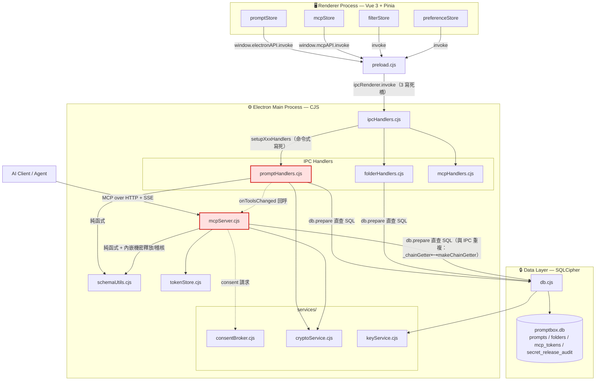
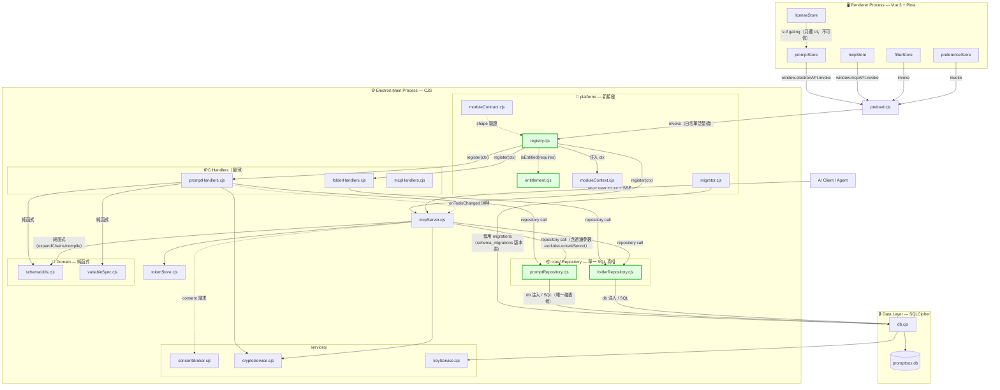

# ARCH — PromptBox 重構前後架構對比（Before / After Refactoring）

## 文件資訊

| 欄位 | 內容 |
|---|---|
| 類型 | 架構視覺總綱（Future Plan 配圖） |
| 日期 | 2026-06-12 |
| 上位文件 | [ADR-005](../ADR/ADR-005.md)、[FP02](FP02.md)、[TD_B1](../Tech%20Design/TD_B1_MCP_Repository_Refactor.md) |
| 基準程式碼 | `PromptBox/electron/`（main）、`PromptBox/src/`（renderer） |
| 對比重點 | **模組耦合度** + **系統擴展性**（差異矩陣另涵蓋資料一致性） |
| 狀態 | 📝 規劃中（尚未實作） |

> **一句話**：現況是 Transaction Script，`mcpServer.cjs` 是與 IPC handler 平行、未接縫的**第二個 DB 存取面（C2）**；
> 目標是 **Hexagonal-lite + 刀口 DDD**——IPC 與 MCP 共用同一 repository 與領域層，並以「模組契約 + 權益閘門」承載付費版本。

### 圖例（Edge / 節點約定）

- `-->|REST/IPC invoke|` 實線：同步呼叫 / 資料存取依賴。
- `-.->|event / callback|` 虛線：非同步事件、回呼或弱依賴（如 `onToolsChanged`、`isEntitled`）。
- 🟥 紅框節點：耦合痛點（直接 `db.prepare`、雙存取面）。🟩 綠框節點：新接縫（repository / registry / 閘門）。
- **保留模組在前後兩圖使用相同 Node ID 與形狀**，差異僅以 subgraph 歸屬、連線標註與顏色表達。

---

## Before Refactoring（原架構：Transaction Script + 雙 DB 存取面 C2）

**痛點標註**：🟥 `promptHandlers.cjs` 與 `mcpServer.cjs` 各自 `db.prepare()`——同一規則兩處實作（C2），
改一處漏一處；`ipcHandlers.cjs` 命令式寫死（C3）；`db.cjs` 集中 schema、無版本表（C5/C6）；preload 3 個寫死橋（C9）；Renderer 無權益狀態（C10）。

---

## After Refactoring（新架構：Hexagonal-lite + 刀口 DDD + 模組契約/權益閘門）

**接縫標註**：🟩 `promptRepository/folderRepository` 是**唯一**碰 prompts/folders 表的層，IPC 與 MCP 同為消費者（消 C2）；
`registry` 過 `entitlement` 閘門後才 `register(ctx)`——未授權模組**根本不註冊**（main 唯一可信閘門）；
`migrator` + `schema_migrations` 取代 try/catch 加欄位；`variableSync` 統一變數抽取真相（消 C8）。

> 與 ADR-005 §五呼應：repository **埠**到 client/server 拆分時原地升級為網路邊界（本地接 SQLite 配接器、雲端接 HTTP 配接器，領域邏輯不改）。

---

## 技術分析

### 一、架構差異矩陣

| 維度 | Before（Transaction Script） | After（Hexagonal-lite + 刀口 DDD） | 客觀變化 |
|---|---|---|---|
| **模組耦合度** | 傳輸 + 業務 + SQL 焊死於 handler；`mcpServer.cjs` 為**第二個** DB 存取面（C2），`_chainGetter`/`makeChainGetter` 雙拷貝；註冊命令式寫死（C3） | repository 為唯一資料存取埠，IPC/MCP 共用；領域規則抽純函式；模組經 registry 自我註冊 | 從 N×直連 → 單一 repository 接縫；雙實作 SQL 歸一 |
| **資料一致性** | 同一張表兩條路徑、兩份過濾 SQL，易漂移（「GUI 看得到、AI 看不到」回歸風險） | 單一 SQL 真相；過濾差異**參數化**保留（`excludeLocked/excludeSecret`）；以「IPC ∪ MCP 行為聯集」為驗收基準 + 黃金樣本比對 | 一致性由「人工同步兩處」→「結構性單一真相」 |
| **系統擴展性** | 無 registry / 無 entitlement / 無版本表；付費模組無閘門可掛；preload 寫死、Renderer 無權益狀態 | 模組契約 `{id, requires, ipc, migrations, mcpTools, register}` + 權益閘門（未授權即不掛，fail-safe 退回本地）；migrator 讓模組擁有自有表/migration；preload 白名單泛型橋 + `licenseStore` | 從「不可插拔」→「可插拔、可分版（mode/feature/compliance）、六角埠可複用至 client/server」 |

### 二、對比重點：耦合度 + 擴展性（聚焦）

- **耦合度（解耦）**：核心收斂是消滅 **C2**——`mcpServer.cjs` 不再 `db.prepare()`，與 IPC 共用 `promptRepository/folderRepository`。
  受益最直接者是 `_chainGetter`⟷`makeChainGetter` 兩份拷貝合一為 `getChainRef`。**即使最終不賣插件也淨賺**（DRY + 可單元測試 + DB 可維護）。
- **擴展性（可插拔）**：`registry + entitlement + moduleContract` 三件套讓 core 與未來 add-on **用同一套契約寫**，
  不養雙軌技術債；權益判定在 main process（renderer `licenseStore` 只藏 UI、永不可信）。六角 repository 埠日後原地升級為 client/server 網路邊界。

### 三、權衡（Trade-off）評估

| 新增成本 / 技術債 | 說明 | 緩解（依 FP02/TD_B1） |
|---|---|---|
| **前期平台工程成本** | registry / entitlement / migrator 須先付，短期不直接產出功能 | Strangler Fig 分階段；A+B1+B2「淨賺」段先做，registry/entitlement 看商業確定性再做（YAGNI 防呆） |
| **B1 回歸面大** | 同時牽動「GUI 取卡」與「AI 經 MCP 取卡」兩路徑 | 單一可 revert PR + E2E 黃金樣本逐位元比對 + 機密邊界測試 + 並發壓測 |
| **stateless MCP 狀態污染風險** | `/mcp` 每請求 new server；repository 若持可變狀態會跨請求污染 | 強制 repository 無狀態（只吃 db），lint/review 禁 module-level 快取 |
| **migration 向後相容** | 既有加密 DB 已用 try/catch 加過欄位，引版本表須正確認定 baseline | migrator 冪等 + 失敗即不寫版本 + dry-run + `promptbox.db.plain.bak` |
| **preload 泛型橋擴大攻擊面** | 開放 `invoke(channel)` 破壞 contextIsolation 隔離價值 | channel 白名單（模組註冊時登記），最壞退回靜態橋 / build-time 產生 |
| **間接層增加 = 多一跳** | handler → repository → db 多一層 | 桌面單機、同進程函式呼叫，延遲可忽略；換來可測性與單一真相 |

### 四、明確排除（避免範圍蔓延）

server 側 DDD / bounded context、雲端同步、合規控制項（ISO27001/SOC2/HIPAA）屬 **greenfield**，
待第一個付費模組驗證契約後另立 PRD，**不在本重構圖範圍**（呼應 ADR-005 §六.3、FP02 §〇）。
